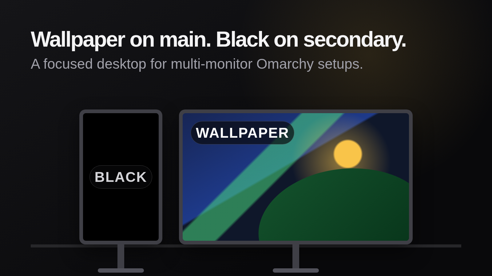

# Secondary Black Background

Keep the Omarchy wallpaper on your main display and show solid black on every secondary display.



## Install

```bash
omarchy plugin add https://github.com/pbjorklund/omarchy-secondary-black-background.git --enable
```

By default, the display focused when the plugin starts is treated as the main display.

For a stable choice, create `~/.config/omarchy/secondary-black-background.json` with output names or case-sensitive monitor-description fragments in priority order:

```json
{
  "mainMonitors": [
    "AW2725Q",
    "DELL U2725QE"
  ]
}
```

Find output names and monitor descriptions with:

```bash
hyprctl monitors -j | jq -r '.[] | "\(.name): \(.description)"'
```

The plugin watches the configuration file and applies changes without a shell restart. If no configured value matches, it falls back to the focused display, then the first connected display. If monitor state cannot be read, the black overlay stays hidden so the normal Omarchy wallpaper remains visible.

## Remove

```bash
omarchy plugin remove io.github.pbjorklund.secondary-black-background --yes
rm -f ~/.config/omarchy/secondary-black-background.json
```

## Dependencies

The plugin has no extra runtime dependencies beyond Omarchy 4 and its Quickshell Hyprland integration. The optional monitor-discovery command shown above uses `hyprctl` and `jq`.

## Development checks

Run the dependency-light test and validation suite with:

```bash
./scripts/check.sh
```

The suite requires Node.js and `jq`. It tests configuration parsing, monitor selection, manifest wiring, documentation commands, preview safety, and shell syntax. It also runs ShellCheck and the official Omarchy validator when they are installed.

## Preview source

The marketplace preview is rendered from `assets/preview.html`:

```bash
./scripts/render-preview.sh
```

Rendering requires Chromium and uses only original CSS artwork from this repository.

## License

MIT
